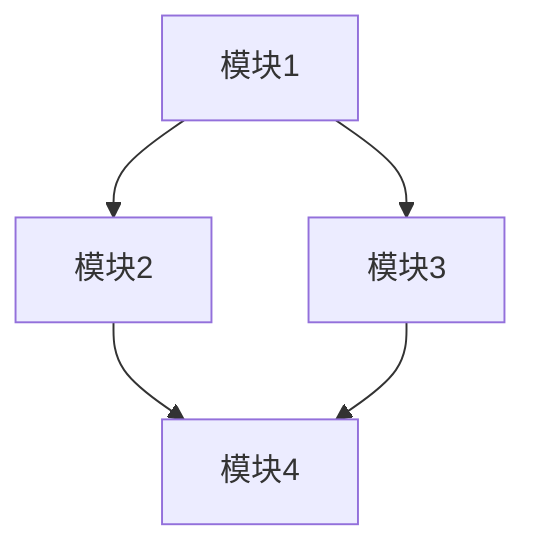

# 模块依赖关系

## 模块列表

| 模块 | 职责 | 状态 |
|------|------|------|
| [模块1] | [职责] | 稳定/开发中/废弃 |
| [模块2] | [职责] | 稳定/开发中/废弃 |
| [模块3] | [职责] | 稳定/开发中/废弃 |

## 依赖关系图



## 依赖矩阵

| 模块 | 依赖 | 被依赖 |
|------|------|--------|
| 模块1 | 模块2, 模块3 | - |
| 模块2 | 模块4 | 模块1 |
| 模块3 | 模块4 | 模块1 |
| 模块4 | - | 模块2, 模块3 |

## 模块详细说明

### 模块1: [名称]

**职责**: [详细职责描述]

**依赖**:
- 模块2: [依赖原因]
- 模块3: [依赖原因]

**被依赖**:
- 无

**公开接口**:
- `function1()`: [用途]
- `class1`: [用途]

### 模块2: [名称]

**职责**: [详细职责描述]

**依赖**:
- 模块4: [依赖原因]

**被依赖**:
- 模块1: [被依赖原因]

**公开接口**:
- `function2()`: [用途]
- `class2`: [用途]

### 模块3: [名称]

**职责**: [详细职责描述]

**依赖**:
- 模块4: [依赖原因]

**被依赖**:
- 模块1: [被依赖原因]

**公开接口**:
- `function3()`: [用途]
- `class3`: [用途]

### 模块4: [名称]

**职责**: [详细职责描述]

**依赖**:
- 无

**被依赖**:
- 模块2: [被依赖原因]
- 模块3: [被依赖原因]

**公开接口**:
- `function4()`: [用途]
- `class4`: [用途]

## 循环依赖

[记录循环依赖情况，如有]

- 模块A <-> 模块B: [原因和解决方案]

## 依赖层次

```
Layer 4: [高层模块]
    ↓
Layer 3: [中层模块]
    ↓
Layer 2: [基础模块]
    ↓
Layer 1: [核心模块]
```

## 依赖管理规则

1. **单向依赖**: 依赖关系应该是单向的，避免循环依赖
2. **层次清晰**: 高层模块可以依赖低层模块，反之不行
3. **接口隔离**: 通过接口隔离依赖，减少耦合
4. **依赖注入**: 使用依赖注入管理依赖关系

---

*最后更新: [日期]*
