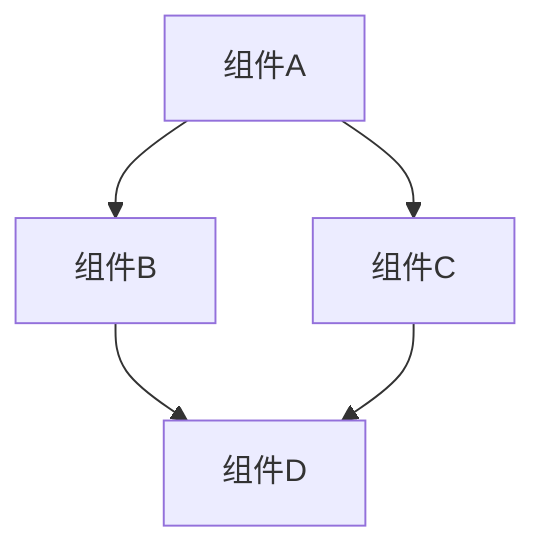

# 系统架构概述

## 项目信息

- **项目名称**: [从配置文件提取]
- **技术栈**: [自动检测]
- **架构模式**: [MVC/微服务/单体等]
- **主要语言**: [TypeScript/Python/Rust/Go 等]
- **框架**: [React/Vue/Django/Flask 等]

## 核心组件

[自动扫描并列出主要组件]

| 组件 | 职责 | 位置 |
|------|------|------|
| [组件1] | [职责描述] | [目录路径] |
| [组件2] | [职责描述] | [目录路径] |

## 依赖关系图



## 关键路径

[识别关键业务流程]

1. **[业务流程1]**
   - 入口: [文件/函数]
   - 处理: [步骤描述]
   - 输出: [结果]

2. **[业务流程2]**
   - 入口: [文件/函数]
   - 处理: [步骤描述]
   - 输出: [结果]

## 目录结构

```
project-root/
├── src/                   # 源代码
│   ├── components/        # 组件
│   ├── services/          # 服务
│   ├── utils/             # 工具函数
│   └── index.ts           # 入口
├── tests/                 # 测试
├── docs/                  # 文档
├── config/                # 配置
└── scripts/               # 脚本
```

## 设计原则

[记录项目的设计原则和约束]

1. **[原则1]**: [描述]
2. **[原则2]**: [描述]
3. **[原则3]**: [描述]

## 技术选型

| 类别 | 选择 | 原因 |
|------|------|------|
| 语言 | [语言] | [原因] |
| 框架 | [框架] | [原因] |
| 数据库 | [数据库] | [原因] |
| 构建工具 | [工具] | [原因] |

## 性能考虑

[记录性能相关的考虑和优化]

- [考虑1]
- [考虑2]
- [考虑3]

## 安全考虑

[记录安全相关的考虑和措施]

- [考虑1]
- [考虑2]
- [考虑3]

---

*最后更新: [日期]*
