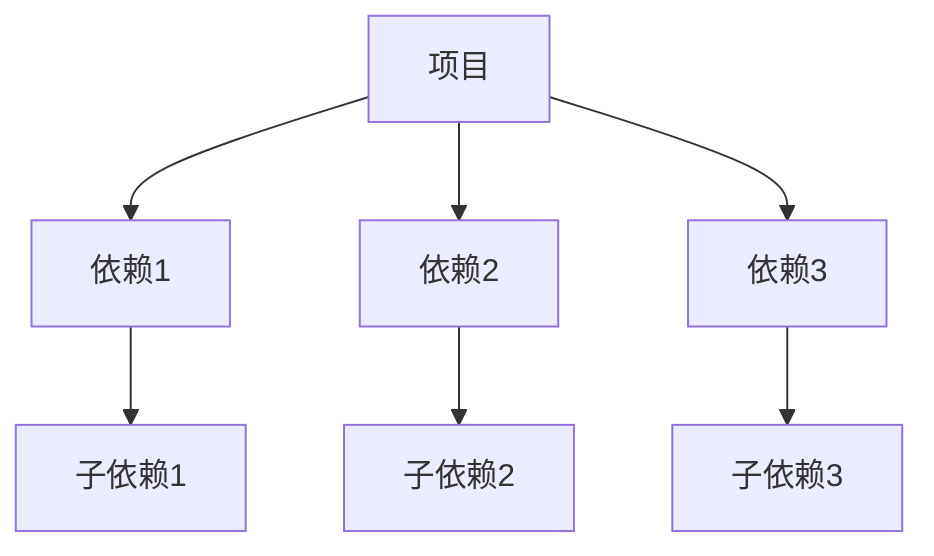

# 依赖关系

> 记录项目的依赖关系，便于管理和维护。
> 依赖发生变化时，请及时更新此文档。

## 依赖分类

### 运行时依赖

| 依赖 | 版本 | 用途 | 许可证 | 最后更新 |
|------|------|------|--------|---------|
| [依赖1] | [版本] | [用途] | [许可证] | [日期] |
| [依赖2] | [版本] | [用途] | [许可证] | [日期] |
| [依赖3] | [版本] | [用途] | [许可证] | [日期] |

### 开发依赖

| 依赖 | 版本 | 用途 | 许可证 | 最后更新 |
|------|------|------|--------|---------|
| [依赖1] | [版本] | [用途] | [许可证] | [日期] |
| [依赖2] | [版本] | [用途] | [许可证] | [日期] |
| [依赖3] | [版本] | [用途] | [许可证] | [日期] |

### 对等依赖

| 依赖 | 版本 | 用途 | 许可证 | 最后更新 |
|------|------|------|--------|---------|
| [依赖1] | [版本] | [用途] | [许可证] | [日期] |
| [依赖2] | [版本] | [用途] | [许可证] | [日期] |
| [依赖3] | [版本] | [用途] | [许可证] | [日期] |

## 依赖关系图

## 依赖详情

### [依赖名称]

**版本**: [版本号]

**用途**: [详细用途描述]

**许可证**: [许可证类型]

**维护状态**: 活跃/不活跃/已废弃

**最后更新**: [日期]

**安全漏洞**: 有/无

**替代方案**: [替代方案，如有]

**注意事项**: [使用注意事项]

## 依赖管理

### 版本管理策略

1. **语义化版本**: 使用语义化版本号
2. **锁定版本**: 使用锁定文件确保一致性
3. **定期更新**: 定期更新依赖版本
4. **安全更新**: 及时更新安全补丁

### 更新流程

1. **检查更新**: 检查可用的更新
2. **评估影响**: 评估更新的影响
3. **测试验证**: 在测试环境中验证
4. **逐步更新**: 逐步更新依赖
5. **监控问题**: 监控更新后的问题

### 安全管理

1. **安全扫描**: 定期进行安全扫描
2. **漏洞修复**: 及时修复安全漏洞
3. **许可证检查**: 检查依赖的许可证
4. **依赖审计**: 定期进行依赖审计

## 依赖问题

### 已知问题

| 依赖 | 问题 | 影响 | 解决方案 |
|------|------|------|---------|
| [依赖1] | [问题] | [影响] | [方案] |
| [依赖2] | [问题] | [影响] | [方案] |
| [依赖3] | [问题] | [影响] | [方案] |

### 版本冲突

| 依赖 | 冲突版本 | 要求版本 | 解决方案 |
|------|---------|---------|---------|
| [依赖1] | [版本] | [版本] | [方案] |
| [依赖2] | [版本] | [版本] | [方案] |
| [依赖3] | [版本] | [版本] | [方案] |

## 依赖优化

### 优化建议

1. **移除未使用的依赖**: 定期清理未使用的依赖
2. **合并相似依赖**: 合并功能相似的依赖
3. **使用轻量级替代**: 使用更轻量级的替代方案
4. **按需加载**: 实现依赖的按需加载

### 优化效果

| 优化项 | 优化前 | 优化后 | 效果 |
|--------|--------|--------|------|
| 包大小 | [大小] | [大小] | [效果] |
| 加载时间 | [时间] | [时间] | [效果] |
| 内存使用 | [使用] | [使用] | [效果] |

## 依赖统计

### 按类型统计

| 类型 | 数量 | 占比 |
|------|------|------|
| 运行时依赖 | [数量] | [百分比] |
| 开发依赖 | [数量] | [百分比] |
| 对等依赖 | [数量] | [百分比] |

### 按许可证统计

| 许可证 | 数量 | 占比 |
|--------|------|------|
| MIT | [数量] | [百分比] |
| Apache-2.0 | [数量] | [百分比] |
| ISC | [数量] | [百分比] |
| 其他 | [数量] | [百分比] |

### 按维护状态统计

| 状态 | 数量 | 占比 |
|------|------|------|
| 活跃 | [数量] | [百分比] |
| 不活跃 | [数量] | [百分比] |
| 已废弃 | [数量] | [百分比] |

## 依赖更新记录

### 最近更新

| 依赖 | 旧版本 | 新版本 | 更新日期 | 更新原因 |
|------|--------|--------|---------|---------|
| [依赖1] | [版本] | [版本] | [日期] | [原因] |
| [依赖2] | [版本] | [版本] | [日期] | [原因] |
| [依赖3] | [版本] | [版本] | [日期] | [原因] |

### 计划更新

| 依赖 | 当前版本 | 目标版本 | 计划日期 | 更新原因 |
|------|---------|---------|---------|---------|
| [依赖1] | [版本] | [版本] | [日期] | [原因] |
| [依赖2] | [版本] | [版本] | [日期] | [原因] |
| [依赖3] | [版本] | [版本] | [日期] | [原因] |

## 依赖工具

### 包管理器

- **npm**: [版本]
- **yarn**: [版本]
- **pnpm**: [版本]

### 依赖分析工具

- **工具1**: [用途]
- **工具2**: [用途]
- **工具3**: [用途]

### 安全扫描工具

- **工具1**: [用途]
- **工具2**: [用途]
- **工具3**: [用途]

## 最佳实践

### 依赖选择

1. **活跃维护**: 选择活跃维护的依赖
2. **社区支持**: 选择有良好社区支持的依赖
3. **许可证兼容**: 确保许可证与项目兼容
4. **安全性**: 检查依赖的安全性
5. **性能**: 考虑依赖的性能影响

### 依赖使用

1. **最小化依赖**: 尽量减少依赖数量
2. **按需引入**: 只引入需要的模块
3. **版本锁定**: 锁定依赖版本
4. **定期更新**: 定期更新依赖
5. **监控安全**: 监控依赖的安全漏洞

### 依赖维护

1. **定期审查**: 定期审查依赖
2. **及时更新**: 及时更新依赖
3. **清理无用**: 清理无用的依赖
4. **记录变更**: 记录依赖变更
5. **测试验证**: 更新后进行测试

---

*最后更新: [日期]*
